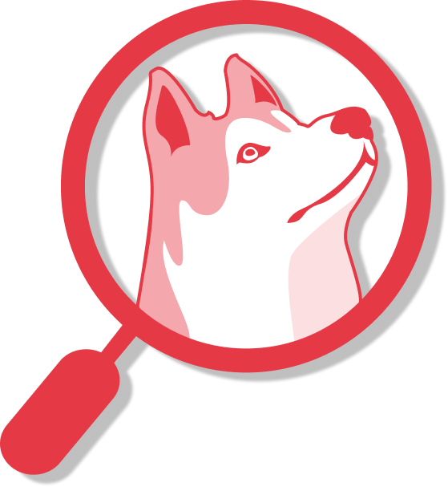

 

  
  

 

         

---

SearchNEU lets you easily search for classes, professors, and subjects at Northeastern. All the data on the site is scraped from different parts of Northeastern's websites and updated daily. The scrapers themselves run on the Course Catalog API, which is hosted on Amazon Web Services.

SearchNEU is maintained by [Sandbox](https://www.sandboxnu.com/), Northeastern's student-led software consultancy.

### Feedback📝🤔

We're curious to hear what you have to say! Feel free to fill out the feedback form in the footer of our [landing page]("https://searchneu.com/NEU") if you have any feedback for us.

### API🔌

You can find the API used by SearchNEU and GraduateNU to get class and professor information [here](https://github.com/sandboxnu/course-catalog-api).

### Contributors😍🎉

SearchNEU was originally created and built in 2017 by [Ryan Hughes](https://github.com/ryanhugh). Thank you Ryan for making SearchNEU what it is!

Shout out to our current team of developers and designers 💖

- Andrew Dai   
- Zachar Hankewycz  
- Simar Chadha 
- Adam Koulopoulos 
- Sebastian Wittrock 
- Puneet Johal  
- Diana Steelman  
- Autumn Fung  

And a special thank you to the following folks for contributing!

- [Edward Li](https://github.com/NEUDitao)
- [Edward Shen](https://github.com/edward-shen)
- [Sean Hughes](https://github.com/seanhugh)
- [Mitch Gamburg](https://github.com/gamburgm)
- [Da-Jin Chu](https://github.com/dajinchu)
- [Daniel Wang](https://github.com/zefwang)
- [Amiel Monasterial](https://github.com/amielmon)
- [Arun Jeevanantham](https://github.com/ArunJ98)
- [Eliza Huang](https://github.com/lizzij)
- [Alex Takayama](https://github.com/bugsalexander)
- [Emily Pillay](https://github.com/epillay)
- [Dillon Hammer](https://github.com/dillonhammer)
- [Megan Li](https://github.com/megandouli)
- [Becca Johnson](https://github.com/beccajohnson17)
- [Kimin Kim](https://github.com/kiminkim724)

### License

SearchNEU is licensed under AGPL3. Any derivative work, such as projects that use the data on the site, must also be open source. See the LICENSE file for details. Feel free to reach out if you have any questions about this.
